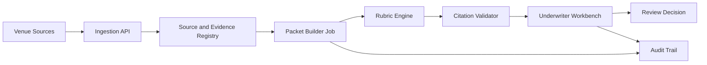

# Nightline Risk Engine: Architecture Spec

**Date:** 2026-05-05  
**Version:** v1.0  
**Status:** Production-shaped architecture proposal  
**Audience:** SDE III interview review, product engineering planning

---

## 1. Executive Summary

Nightline is a new kind of AI-powered insurance broker for real-world businesses, starting with nightlife venues: bars, clubs, and music venues. The company is attacking the affordability crisis facing cultural businesses by using operational evidence to improve underwriting and defend against the lawsuits that drive premium hikes.

The Nightline Risk Engine turns venue operational data into cited underwriting packets and claims-defense records. The product goal is not to replace underwriters with an autonomous model. The goal is to give an underwriter a defensible packet that explains what happened, which evidence supports each risk signal, which rubric version was applied, and what decision the human reviewer made.

The credible v1 product slice is:

- **Underwriter Workbench:** a review console where underwriters inspect incidents, evidence, risk signals, citations, packet snapshots, and review decisions.
- **Evidence Vault foundations:** a source registry and immutable packet history that make lawsuit defense possible from the start, even if the first shipped workflow is underwriting review.

This architecture starts from the current deterministic demo and moves toward a production-shaped system. Model use is progressive: deterministic scoring and citation validation come first; LLM-assisted drafting can be added later behind provider interfaces; no model is treated as a compliance authority.

### 1.1 Company Context

Nightline's mission is to keep cultural businesses alive by making insurance more affordable and more defensible. The wedge is nightlife because these venues face acute liability pressure, thin operating margins, and fragmented operational records that are hard for carriers and claims teams to evaluate.

Architecturally, the system needs to combine operator-grade venue context with fintech-grade auditability. It should serve underwriting and claims defense together, not just produce a risk score.

---

## 2. Current State

The repository today is a deterministic FastAPI and Next.js demo:

- One seeded venue and a narrow incident workflow.
- Python logic generates risk signals, timeline entries, and an underwriter memo.
- Frontend screens display the underwriter console experience.
- Evidence is seeded or locally simulated rather than ingested from live venue systems.
- There are no live LLM calls, no production retrieval layer, and no real camera or POS integration.

This is the right shape for a demo, but not yet a production risk engine. The next step is not a large distributed agent platform. The next step is a reliable packet workflow with traceable data contracts, audit logging, and human review.

---

## 3. Target v1 Architecture

v1 should ship a production-shaped underwriting packet workflow. It should support real users reviewing real incidents while keeping the system small enough to reason about and operate.



### 3.1 API Layer

FastAPI remains the backend boundary for ingestion, packet generation, review, and packet retrieval. The API should expose explicit resources instead of agent-shaped abstractions:

- `venues`
- `incidents`
- `sources`
- `citations`
- `packets`
- `review_decisions`
- `audit_events`

The API should be boring by design: validate inputs, enforce tenant and role access, return stable IDs, and avoid hiding business rules behind prompt behavior.

### 3.2 Relational Store

Move from SQLite demo persistence to Postgres for the production-shaped system. Postgres should hold transactional records, review state, source metadata, packet snapshots, rubric versions, and audit events.

Binary evidence should not be stored directly in relational rows. v1 can use object storage later for large files, but the core contract should start with object references, hashes, timestamps, source system IDs, and retention metadata.

### 3.3 Source and Evidence Registry

The source registry is the foundation of both underwriting defensibility and later lawsuit defense. Every derived risk signal must point back to evidence that the system can identify, explain, retain, and export when a claim or carrier review requires it.

v1 sources can include:

- POS export rows or receipts.
- HR and staffing logs.
- Incident reports.
- Door or security logs.
- Camera footage references or camera-derived metadata, starting with seeded metadata or clip references rather than raw video processing.

Each source record should include provenance: where it came from, when it was collected, how it was normalized, whether it is usable for packet generation, and whether it should be retained for claims defense.

### 3.4 Packet Builder Jobs

Packet generation should run as a background job instead of a synchronous UI action. A simple queue or worker process is enough for v1. The job should:

1. Load an incident and eligible sources.
2. Normalize evidence into packet facts.
3. Run the deterministic rubric engine.
4. Validate that every claim has a citation.
5. Snapshot the packet output.
6. Emit audit events for generation, validation, and review transitions.

This keeps packet construction repeatable and prepares the system for retries without committing early to Temporal, Kafka, or Kubernetes.

### 3.5 Deterministic Rubric Engine

The rubric engine should be deterministic and versioned. It should not depend on an LLM to decide whether a venue is risky.

A rubric version should define:

- Inputs it expects.
- Rules it evaluates.
- Risk signal IDs it can emit.
- Score deltas or severity labels.
- Required citation types.
- Prohibited factors and disallowed fields.

Example rule shape:

```text
If service activity continues after the permitted cutoff window,
emit AFTER_HOURS_SERVICE with severity HIGH and require POS or staff-log citation.
```

The output should be machine-checkable. Memo prose is secondary to structured findings.

### 3.6 Citation Validator

The citation validator should enforce the most important trust invariant: every underwriting claim must be backed by a valid source.

For v1, validation can be deterministic:

- The cited source exists.
- The source belongs to the same venue and incident scope.
- The source type is allowed for the claim type.
- The cited field or excerpt is present.
- The source was available before packet snapshot time.

If any required citation fails validation, the packet should be marked `needs_review` or `invalid`, not silently published.

### 3.7 Underwriter Workbench

The Next.js UI should be the primary product surface. It should help underwriters inspect and decide, not merely watch an agent trace.

Core workflows:

- Open an incident packet.
- Review risk signals and supporting citations.
- Compare packet summary, claims timeline, and evidence details.
- Approve, reject, or request more information.
- Record an override reason when the underwriter disagrees with the generated signal.
- View packet version history and audit events.

Human review is part of the control system. The underwriter decision is a first-class record, not a footnote to an automated output.

### 3.8 Audit Trail

The audit trail should capture state transitions and evidence access:

- Source ingested.
- Packet job started, completed, failed, or invalidated.
- Rubric version applied.
- Citation validation passed or failed.
- Underwriter opened the packet.
- Decision recorded.
- Packet snapshot exported.

For v1, append-only database rows are enough. A later phase can add stronger tamper-evidence if carrier or claims requirements demand it.

---

## 4. Core Data Contracts

These are high-level contracts, not final database schemas.

### Venue

Represents an insured or prospect venue.

Key fields:

- `id`
- `name`
- `location`
- `tenant_id`
- `operating_profile`
- `created_at`

### Incident

Represents an event being evaluated for underwriting or claims relevance.

Key fields:

- `id`
- `venue_id`
- `occurred_at`
- `reported_at`
- `incident_type`
- `status`
- `summary`

### Source

Represents original or normalized evidence.

Key fields:

- `id`
- `venue_id`
- `incident_id`
- `source_type`
- `origin_system`
- `external_ref`
- `collected_at`
- `content_hash`
- `metadata`
- `retention_policy`

### Citation

Links a packet claim to a source.

Key fields:

- `id`
- `source_id`
- `claim_id`
- `citation_type`
- `field_path`
- `excerpt`
- `validated_at`
- `validation_status`

### RubricVersion

Represents the exact rule set used to generate risk signals.

Key fields:

- `id`
- `name`
- `version`
- `effective_at`
- `rules`
- `prohibited_fields`
- `created_by`

### UnderwritingPacket

Represents the generated packet snapshot reviewed by the underwriter.

Key fields:

- `id`
- `incident_id`
- `rubric_version_id`
- `status`
- `risk_signals`
- `timeline`
- `memo`
- `citation_ids`
- `snapshot_hash`
- `generated_at`

### ReviewDecision

Represents the human decision on a packet.

Key fields:

- `id`
- `packet_id`
- `reviewer_id`
- `decision`
- `override_reason`
- `notes`
- `decided_at`

### AuditEvent

Represents an append-only operational or review event.

Key fields:

- `id`
- `actor_id`
- `actor_type`
- `entity_type`
- `entity_id`
- `event_type`
- `metadata`
- `created_at`

---

## 5. Trust, Safety, and Compliance

Insurance underwriting is high stakes. The system must make review easier without inventing authority it does not have.

### 5.1 Deterministic Controls First

v1 trust should come from deterministic controls:

- Versioned rubric rules.
- Required citation checks.
- Source provenance.
- Human review decisions.
- Immutable packet snapshots.
- Audit events for review and export.

LLMs can later help draft prose or suggest missing context, but deterministic validation remains the source of control.

### 5.2 Human Review Boundary

The system can recommend, summarize, and organize. It should not autonomously bind coverage, deny coverage, or make final underwriting decisions.

Every generated packet should have a review state. Every override should be captured with a reason so product and underwriting teams can improve the rubric.

### 5.3 Prohibited-Factor Controls

Rubrics and packet builders should explicitly exclude prohibited or sensitive fields from scoring. v1 should enforce this structurally by controlling which normalized fields are eligible for rubric inputs.

The system should also log when a packet was generated with a specific rubric version so future audits can reconstruct what logic was applied.

### 5.4 Privacy and Retention

v1 should minimize raw evidence handling. It can operate on references, excerpts, normalized records, and metadata before attempting raw video ingestion.

Retention should be explicit per source type. Claims-defense evidence may need a different retention policy than routine operational telemetry.

### 5.5 Model Use Policy

Future LLM usage should sit behind provider interfaces and be limited to bounded tasks:

- Drafting memo prose from already validated findings.
- Suggesting missing evidence for human review.
- Rewriting underwriter-facing summaries in neutral language.
- Flagging possible citation inconsistencies for deterministic re-check.

Models should not be the final compliance judge, source of truth, or autonomous scoring authority.

---

## 6. Phased Roadmap

### Phase 1: Production-Shaped Packet Workflow

Goal: ship a reliable Underwriter Workbench backed by source registry, packet jobs, deterministic rubric evaluation, citation validation, and audit logging.

Prerequisites:

- Stable incident and source contracts.
- Postgres persistence.
- Background worker for packet generation.
- Seeded or manually uploaded evidence.
- Underwriter review UI with decision capture.

This phase proves the core product claim: operational evidence can generate a defensible underwriting packet.

### Phase 2: Retrieval and Assisted Drafting

Goal: improve packet context and memo quality without changing the control boundary.

Additions:

- Vector retrieval for policy documents, underwriting guidelines, and historical packet examples.
- Provider-backed memo drafting from structured packet findings.
- LLM output stored as draft text, not scoring truth.
- Automated checks that draft claims still map to validated citations.

Prerequisites:

- Reliable citation validator.
- Clear provider abstraction.
- Evaluation set for memo quality, neutrality, and citation faithfulness.

### Phase 3: Claims Evidence Vault

Goal: extend the underwriting packet history into claims defensibility so Nightline can help venues and carriers respond to lawsuits with organized, cited operational evidence.

Additions:

- Evidence export workflow.
- Stronger packet immutability guarantees.
- Legal or claims reviewer view.
- Expanded source retention policies.
- Evidence access audit trail.
- Lawsuit-response packet assembly from the same source and citation graph used for underwriting.

Prerequisites:

- Stable source registry.
- Packet snapshot hashes.
- Access controls by role and tenant.

### Phase 4: Richer Ingestion and Edge Signals

Goal: ingest higher-volume venue signals once the packet workflow has proven value for underwriting and claims defense.

Possible additions:

- POS connectors.
- HR and staffing system connectors.
- Door count and security log integrations.
- Camera footage references and camera-derived metadata.
- Later edge vision processing for narrow, consented, privacy-reviewed use cases.

Prerequisites:

- Data processing agreements.
- Privacy review.
- Retention model.
- Operational support model for venue integrations.
- Evidence quality metrics that show the new signals improve underwriting or claims outcomes.

---

## 7. Explicit Non-Goals for v1

v1 should not attempt:

- Raw video processing or real-time computer vision.
- A mobile venue app.
- Autonomous underwriting decisions.
- Actuarial performance claims.
- Kubernetes-based service mesh.
- Kafka or Redpanda streaming infrastructure.
- Temporal workflows.
- CRDT edge sync.
- LLM-as-compliance-authority.
- Fine-tuning based on underwriter overrides.

These may become reasonable later, but only after the source registry, packet workflow, review loop, and audit trail are reliable.

---

## 8. Interview Defense

The architecture is intentionally conservative. For an SDE III review, the defensible decision is to ship the smallest production-shaped system that proves the business loop:

1. Collect evidence.
2. Normalize it into source records.
3. Generate structured risk signals with a versioned rubric.
4. Validate citations.
5. Present a packet to a human underwriter.
6. Record the decision and audit trail.

That path creates a platform foundation without pretending the demo already has an agent mesh, a real-time CV fleet, or a compliance-grade LLM judge. It also leaves clear extension points for retrieval, drafting, claims export, and richer ingestion once the core workflow has earned more complexity.
